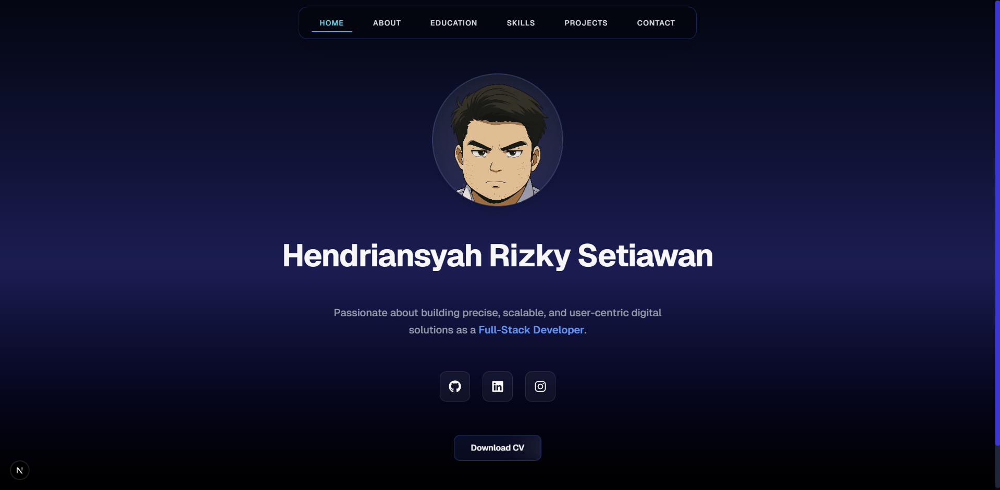

# Portfolio Project Documentation

## Overview

This project is a personal portfolio website for Hendriansyah Rizky Setiawan, a Full-Stack Developer specializing in web and mobile applications. Built using **Next.js**, **React**, and **Firebase**, it showcases skills, projects, and educational background in a modern, responsive, and interactive interface. The portfolio supports user authentication, project management, and multilingual content, with dynamic sections for home, about, education, skills, projects, and contact.

  
*Screenshot of the portfolio website showcasing its modern and responsive design.*

[](https://github.com/kyy-95631488/hendriansyah-project)

Key features include:
- **User Authentication**: Register and login functionality using Firebase Authentication.
- **Project Management**: Users can add, edit, and view project details stored in Firebase Firestore.
- **Skills Showcase**: Displays proficiency in technologies like Kotlin, Java, React, Flutter, and more.
- **Responsive Design**: Optimized for mobile, tablet, and desktop using Tailwind CSS.
- **Interactive UI**: Smooth animations with Framer Motion and dynamic content loading.
- **Multilingual Support**: Toggle between English and Bahasa Indonesia for skills section.
- **SEO Optimization**: Metadata and structured data for better search engine visibility.

The project is deployed on Vercel and integrates analytics for tracking user interactions.

---

## Environment Setup

To set up and run the project locally, follow these steps:

### Prerequisites
- **Node.js**: Version 18.x or higher (includes npm).
- **Git**: For cloning the repository.
- **Firebase Account**: For authentication and Firestore database.
- **Supabase Account**: For additional backend services (optional).
- **Gmail Account**: For SMTP email configuration (used in contact form).
- **Vercel Account**: For deployment (optional).

### Installation Steps

1. **Clone the Repository**
   ```bash
   git clone https://github.com/kyy-95631488/hendriansyah-project.git
   cd hendriansyah-project
   ```

2. **Install Dependencies**
   ```bash
   npm install
   ```
   This installs all dependencies listed in `package.json`, including:
   - `next`, `react`, `react-dom` for the framework and UI.
   - `firebase` for authentication and Firestore.
   - `framer-motion` for animations.
   - `lucide-react` and `react-icons` for icons.
   - `tailwindcss` for styling.
   - `@supabase/supabase-js` for Supabase integration.
   - `nodemailer` for email functionality.
   - `@vercel/analytics` for analytics.

3. **Configure Environment Variables**
   Create a `.env.local` file in the root directory and add the following:
   ```env
   SMTP_HOST=smtp.gmail.com
   SMTP_USER=your-email@gmail.com
   SMTP_PASS=your-app-password

   NEXT_PUBLIC_FIREBASE_API_KEY=your-firebase-api-key
   NEXT_PUBLIC_FIREBASE_AUTH_DOMAIN=your-firebase-auth-domain
   NEXT_PUBLIC_FIREBASE_PROJECT_ID=your-firebase-project-id
   NEXT_PUBLIC_FIREBASE_STORAGE_BUCKET=your-firebase-storage-bucket
   NEXT_PUBLIC_FIREBASE_MESSAGING_SENDER_ID=your-firebase-sender-id
   NEXT_PUBLIC_FIREBASE_APP_ID=your-firebase-app-id

   NEXT_PUBLIC_SUPABASE_URL=your-supabase-url
   NEXT_PUBLIC_SUPABASE_ANON_KEY=your-supabase-anon-key
   ```
   - Replace `your-email@gmail.com` and `your-app-password` with your Gmail credentials (use an App Password for security).
   - Obtain Firebase credentials from your Firebase project console.
   - Obtain Supabase credentials from your Supabase project dashboard.

4. **Set Up Firebase**
   - Create a Firebase project at [console.firebase.google.com](https://console.firebase.google.com).
   - Enable Authentication (Email/Password) and Firestore Database.
   - Add a web app to your Firebase project and copy the configuration to `.env.local`.
   - Initialize Firestore with a collection structure like `users/{userId}/projects`.

5. **Set Up Supabase (Optional)**
   - Create a Supabase project at [supabase.com](https://supabase.com).
   - Copy the URL and Anon Key to `.env.local`.
   - Configure any necessary tables or authentication settings in Supabase.

6. **Run the Development Server**
   ```bash
   npm run dev
   ```
   The app will be available at `http://localhost:3000`.

7. **Build and Start Production Server (Optional)**
   ```bash
   npm run build
   npm run start
   ```

8. **Deploy to Vercel (Optional)**
   - Push the code to a GitHub repository.
   - Connect the repository to Vercel at [vercel.com](https://vercel.com).
   - Add the environment variables in Vercel’s dashboard.
   - Deploy the app, and Vercel will provide a public URL.

### Directory Structure
```
hendriansyah-project/
├── components/                # Reusable React components
│   ├── Navbar.tsx
│   ├── HomeSection.tsx
│   ├── AboutSection.tsx
│   ├── EducationSection.tsx
│   ├── SkillsSection.tsx
│   ├── ProjectsSection.tsx
│   ├── ContactSection.tsx
│   ├── AddProjectSection.tsx
│   ├── EditProfileSection.tsx
│   ├── EditProjectSection.tsx
│   ├── DashboardSection.tsx
├── auth/                      # Firebase authentication setup
│   ├── firebase/
│   │   ├── firebase.ts
├── pages/                     # Next.js pages
│   ├── index.tsx
│   ├── dashboard.tsx
│   ├── auth/
│   │   ├── register.tsx
│   │   ├── login.tsx
│   ├── project/
│   │   ├── add.tsx
│   │   ├── edit.tsx
│   │   ├── [projectId].tsx
│   ├── profile/
│   │   ├── edit.tsx
├── public/                    # Static assets
│   ├── images/
│   │   ├── skills/
│   │   ├── logo-hr.png
│   │   ├── og-image.jpg
│   │   ├── pribadi-kartun.png
├── styles/                    # Global styles
│   ├── globals.css
├── .env.local                 # Environment variables
├── package.json               # Dependencies and scripts
├── next.config.js             # Next.js configuration
├── tailwind.config.js         # Tailwind CSS configuration
├── tsconfig.json              # TypeScript configuration
```

---

## Code Explanation

The project is built with **Next.js 15.4.4**, utilizing TypeScript for type safety, Tailwind CSS for styling, and Firebase for backend services. Below is a breakdown of key components and their functionality:

### 1. Root Layout (`layout.tsx`)
- **Purpose**: Defines the global HTML structure and metadata for SEO.
- **Key Features**:
  - Uses `Geist` and `Geist_Mono` fonts for typography.
  - Includes Open Graph and Twitter metadata for social sharing.
  - Adds structured data for search engine optimization.
  - Integrates Vercel Analytics for tracking.
  - Applies global styles and removes default scrollbars.
- **Code Snippet**:
  ```tsx
  export default function RootLayout({ children }) {
    return (
      <html lang="en">
        <head>
          <meta name="google-site-verification" content="..." />
          <link rel="icon" href="/images/logo-hr.png" />
          <script type="application/ld+json" dangerouslySetInnerHTML={{ ... }} />
        </head>
        <body className={`${geistSans.variable} ${geistMono.variable} ...`}>
          <main>{children}</main>
          <Analytics />
        </body>
      </html>
    );
  }
  ```

### 2. Home Page (`index.tsx`)
- **Purpose**: Serves as the main entry point, rendering dynamic sections.
- **Key Features**:
  - Uses dynamic imports for server-side rendering optimization.
  - Implements a `Navbar` for navigation between sections.
  - Animates section transitions with Framer Motion.
- **Code Snippet**:
  ```tsx
  export default function Home() {
    const [currentSection, setCurrentSection] = useState("home");
    return (
      <div className="min-h-screen ...">
        <Navbar setCurrentSection={setCurrentSection} />
        <AnimatePresence mode="wait">
          <motion.div key={currentSection} ...>
            {renderSection()}
          </motion.div>
        </AnimatePresence>
      </div>
    );
  }
  ```

### 3. Projects Section (`ProjectsSection.tsx`)
- **Purpose**: Displays a user’s projects fetched from Firebase Firestore.
- **Key Features**:
  - Authenticates users and redirects unauthenticated users to the homepage.
  - Fetches projects from Firestore and filters by platform (web, mobile, desktop).
  - Implements a horizontal scroll with navigation arrows.
  - Uses Framer Motion for card animations and Image for optimized images.
- **Code Snippet**:
  ```tsx
  export default function ProjectsSection() {
    const [projects, setProjects] = useState<Project[]>([]);
    useEffect(() => {
      const unsubscribe = onAuthStateChanged(auth, async (firebaseUser) => {
        if (firebaseUser) {
          const projectsCollection = collection(db, `users/${firebaseUser.uid}/projects`);
          const projectsSnapshot = await getDocs(projectsCollection);
          setProjects(projectsSnapshot.docs.map((doc) => ({ id: doc.id, ...doc.data() })));
        } else {
          router.push("/");
        }
      });
      return () => unsubscribe();
    }, [router, db]);
    return (
      <section className="w-full ...">
        <motion.h2 ...>My Projects</motion.h2>
        <div ref={containerRef} className="flex gap-3 ...">
          {filteredProjects.map((project) => (
            <motion.div key={project.id} ...>
              <Image src={project.thumbnailUrl} ... />
              <h4>{project.title}</h4>
              <p>{project.description}</p>
              <motion.button onClick={() => router.push(`/project/${project.id}`)} ...>
                View Details
              </motion.button>
            </motion.div>
          ))}
        </div>
      </section>
    );
  }
  ```

### 4. Register Section (`register.tsx`)
- **Purpose**: Handles user registration with Firebase Authentication.
- **Key Features**:
  - Validates password confirmation.
  - Displays success/error messages with animations.
  - Redirects to login page upon successful registration.
- **Code Snippet**:
  ```tsx
  export default function RegisterSection() {
    const [formData, setFormData] = useState({ email: "", password: "", confirmPassword: "", name: "" });
    const handleSubmit = async (e: FormEvent<HTMLFormElement>) => {
      e.preventDefault();
      if (formData.password !== formData.confirmPassword) {
        setStatus("Error: Passwords do not match");
        return;
      }
      try {
        await createUserWithEmailAndPassword(auth, formData.email, formData.password);
        setStatus("Registration successful! Redirecting...");
        setTimeout(() => { window.location.href = "/auth/login"; }, 1500);
      } catch (error) {
        setStatus(`Error: ${error.message}`);
      }
    };
    return (
      <section className="min-h-[calc(100vh-4rem)] ...">
        <motion.h2 ...>Register</motion.h2>
        <form onSubmit={handleSubmit} ...>
          <input type="text" name="name" value={formData.name} onChange={handleChange} ... />
          <input type="email" name="email" value={formData.email} onChange={handleChange} ... />
          <input type="password" name="password" value={formData.password} onChange={handleChange} ... />
          <input type="password" name="confirmPassword" ... />
          <motion.button type="submit" ...>Sign Up</motion.button>
        </form>
      </section>
    );
  }
  ```

### 5. Skills Section (`SkillsSection.tsx`)
- **Purpose**: Showcases the developer’s technical skills with icons.
- **Key Features**:
  - Supports bilingual content (English and Bahasa Indonesia).
  - Displays skills in a responsive grid with hover animations.
  - Uses Image for optimized skill icons with fallback placeholders.
- **Code Snippet**:
  ```tsx
  export default function SkillsSection() {
    const [language, setLanguage] = useState<"id" | "en">("id");
    const skills: Skill[] = [
      { name: "Kotlin", icon: "/images/skills/kotlin.png" },
      { name: "Java", icon: "/images/skills/java.png" },
      // ... other skills
    ];
    return (
      <section id="skills" className="min-h-screen ...">
        <select value={language} onChange={(e) => setLanguage(e.target.value as "id" | "en")} ...>
          <option value="id">Bahasa Indonesia</option>
          <option value="en">English</option>
        </select>
        <motion.h2 ...>{content[language].title}</motion.h2>
        <ul className="grid grid-cols-2 ...">
          {skills.map((skill, index) => (
            <motion.li key={skill.name} ...>
              <Image src={skill.icon} alt={`${skill.name} icon`} ... />
              <span>{skill.name}</span>
            </motion.li>
          ))}
        </ul>
      </section>
    );
  }
  ```

### 6. Project Detail Page (`[projectId].tsx`)
- **Purpose**: Displays detailed information about a specific project.
- **Key Features**:
  - Fetches project data from Firestore based on `projectId`.
  - Supports zoomable images with drag and pinch-to-zoom functionality.
  - Displays technologies, timeline, source code link, and screenshots.
- **Code Snippet**:
  ```tsx
  export default function ProjectDetail() {
    const [project, setProject] = useState<Project | null>(null);
    const [selectedImage, setSelectedImage] = useState<string | null>(null);
    useEffect(() => {
      const unsubscribe = onAuthStateChanged(auth, async (firebaseUser) => {
        if (firebaseUser) {
          const projectRef = doc(db, `users/${firebaseUser.uid}/projects`, projectId);
          const projectSnap = await getDoc(projectRef);
          if (projectSnap.exists()) {
            setProject({ id: projectSnap.id, ...projectSnap.data() } as Project);
          }
        } else {
          router.push("/");
        }
      });
      return () => unsubscribe();
    }, [router, projectId, db]);
    return (
      <section className="min-h-screen ...">
        <motion.h1 ...>{project?.title}</motion.h1>
        <Image src={project?.thumbnailUrl || "https://placehold.co/1920x1080"} ... onClick={() => setSelectedImage(project?.thumbnailUrl)} />
        <motion.div ...>
          <h2>Description</h2>
          <p>{project?.description}</p>
        </motion.div>
        {selectedImage && (
          <motion.div className="fixed inset-0 ..." onClick={() => setSelectedImage(null)}>
            <motion.div style={{ transform: `scale(${zoomLevel}) translate(${position.x}px, ${position.y}px)` }} ...>
              <Image src={selectedImage} ... />
            </motion.div>
          </motion.div>
        )}
      </section>
    );
  }
  ```

### 7. Firebase Integration (`firebase.ts`)
- **Purpose**: Initializes Firebase services for authentication and Firestore.
- **Configuration**: Uses environment variables for secure setup.
- **Usage**: Imported in components requiring Firebase services.

### 8. Styling
- **Tailwind CSS**: Configured in `tailwind.config.js` for utility-first styling.
- **Custom Styles**: Defined in `globals.css` for scrollbar hiding and font variables.
- **Animations**: Handled by Framer Motion for smooth transitions and hover effects.

---

## Comparisons

The project leverages a modern tech stack, but how does it compare to alternative approaches? Below is a comparison with other tools and frameworks:

| **Aspect**                | **Next.js + Firebase (This Project)**                              | **Gatsby + Contentful**                                   | **React + AWS Amplify**                                  |
|---------------------------|--------------------------------------------------------------------|----------------------------------------------------------|---------------------------------------------------------|
| **Framework**             | Next.js (React-based, SSR/SSG)                                     | Gatsby (Static Site Generator)                           | React (Client-side rendering)                           |
| **Backend**               | Firebase (Firestore, Authentication)                               | Contentful (Headless CMS)                                | AWS Amplify (GraphQL, Cognito)                          |
| **Performance**           | Excellent (SSR/SSG, image optimization)                           | Excellent (Static sites, fast load times)                | Good (Client-side, depends on optimization)             |
| **Scalability**           | High (Firebase scales well for small to medium apps)               | High (Static sites scale easily)                         | High (AWS infrastructure)                               |
| **Developer Experience**  | Great (TypeScript, Tailwind, Vercel integration)                   | Good (GraphQL, plugin ecosystem)                         | Moderate (Complex setup for AWS services)               |
| **Authentication**        | Easy (Firebase Auth, pre-built UI)                                 | Requires custom setup or third-party services            | Moderate (Cognito setup required)                       |
| **Database**              | Firestore (NoSQL, real-time)                                       | Contentful (Content-focused, not real-time)              | DynamoDB/AppSync (NoSQL, GraphQL)                       |
| **Cost**                  | Free tier available, pay-as-you-go for Firebase                    | Free tier for Contentful, paid for high usage            | Free tier for AWS, complex pricing for scaling          |
| **Use Case**              | Dynamic portfolio with user authentication and project management  | Static portfolio with content-heavy sites               | Enterprise apps with complex backend needs              |

### Why Next.js + Firebase?
- **Next.js** provides SSR and SSG for SEO and performance, ideal for portfolios.
- **Firebase** simplifies authentication and database management, reducing backend setup time.
- **Tailwind CSS** accelerates styling with utility classes, maintaining consistency.
- **Framer Motion** enhances user experience with minimal code for animations.
- Compared to Gatsby, this stack supports dynamic content and user authentication out of the box.
- Compared to AWS Amplify, Firebase offers a simpler setup for small projects.

### Limitations
- Firebase’s free tier has usage limits (e.g., Firestore reads/writes).
- Next.js’s SSR can increase server costs on high-traffic sites compared to static sites.
- Tailwind CSS may result in larger CSS bundles if not optimized.

---

## Conclusion

This portfolio project demonstrates a robust, modern web application built with Next.js, Firebase, and Tailwind CSS. It effectively showcases Hendriansyah’s skills and projects while providing a seamless user experience. The setup is straightforward, and the code is modular and maintainable. For future enhancements, consider:
- Adding unit tests with Jest or Cypress.
- Implementing offline support with Next.js PWA.
- Optimizing Firestore queries for cost efficiency.

For further details, visit the deployed site at [hendriansyah-project.vercel.app](https://hendriansyah-project.vercel.app) or explore the source code on [GitHub](https://github.com/kyy-95631488).